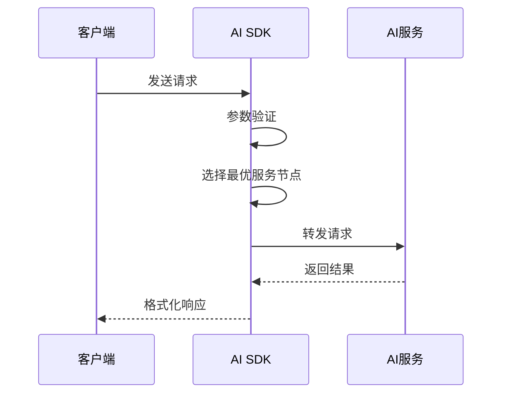

# Smithery AI SDK 核心原理

## 1. 架构设计原理

### 1.1 分层架构

- **客户端层**：提供面向开发者的 API 接口
- **服务层**：处理业务逻辑和会话管理
- **集成层**：对接不同 AI 服务提供商
- **基础设施层**：提供网络、缓存、认证等基础能力

### 1.2 核心设计模式

- **适配器模式**：统一不同 AI 服务的接口规范
- **工厂模式**：动态创建 AI 服务实例
- **观察者模式**：处理异步消息和事件
- **装饰器模式**：增强基础功能（如重试、缓存）

## 2. 关键工作机制

### 2.1 请求处理流程



### 2.2 会话管理机制

- 基于 Token 的会话跟踪
- 上下文保持（最大 128K tokens）
- 自动会话续期（TTL 30 分钟）

## 3. 核心技术实现

### 3.1 多模型统一接口

```typescript
interface AIModel {
  sendRequest(prompt: string, options?: ModelOptions): Promise<ModelResponse>;
  streamResponse(callback: StreamCallback): void;
  getUsage(): ModelUsage;
}
```

### 3.2 智能路由

- 基于延迟、成本、可用性的路由决策
- 自动故障转移（Failover）
- 负载均衡算法（WRR）

### 3.3 性能优化

- 请求批处理（Batching）
- 结果缓存（LRU 策略）
- 连接池管理（最大 100 并发）

## 4. 扩展机制

### 4.1 插件系统

- 支持自定义中间件
- 可扩展的 AI 服务适配器
- 钩子（Hooks）机制

### 4.2 监控指标

- 请求成功率/失败率
- 平均响应时间
- Token 使用统计
- 服务健康状态
